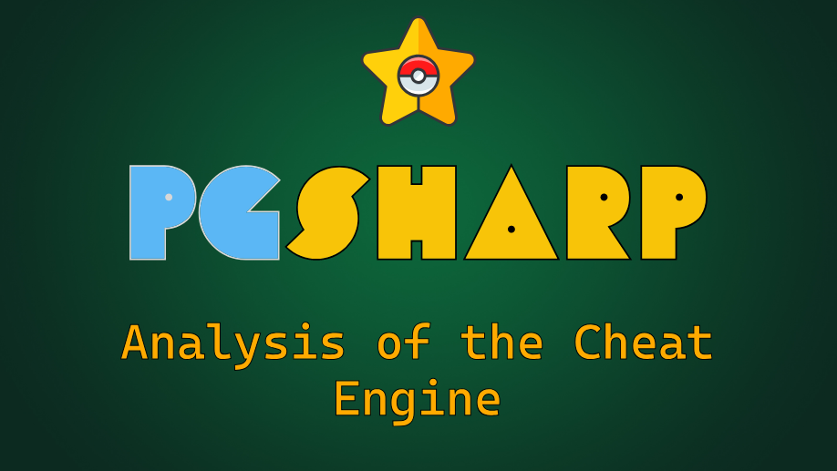

   
   
    

<h3 align="center">PGSharp: Android Cheating App for PokemonGO</h4>

This content is based on the version ``1.33.0`` of PGSharp which is associated
with the version ``0.221.0`` of PokemonGO.

* [PGSharp APK - 1.33.0](https://data.romainthomas.fr/21-09-pgsharp/pgs1.33.0.apk)
* [PokemonGO APK - 0.221.0](https://data.romainthomas.fr/21-09-pgsharp/com.nianticlabs.pokemongo_0.221.0-2021093001.apk)
* [libmain.so (from PGSharp)](https://data.romainthomas.fr/21-09-pgsharp/libmain.so)

## 📁 Content

| File/Dir                             | Description
| :------                              | :-----------
| [libmain.symbols](libmain.symbols)   | Symbols from reverse-engineering
| [jadx](jadx)                         | Jadx visitor to decode strings
| [LZZqoKpt.plg.apk](LZZqoKpt.plg.apk) | PGSharp embedded APK
| [SignatureBypass](SignatureBypass)   | Java code associated with the bypass of the signature
| [zip_diff.py](zip_diff.py)           | Script to identify differences between two zip files
| [lief_diff.py](lief_diff.py)         | Script to identify differences in DEX files
| [lua](lua)                           | Lua bytecode scripts loaded by PGSharp

## ⛚ Slides

[21-10-ekoparty-mobile-hacking-space-pgsharp.pdf](21-10-ekoparty-mobile-hacking-space-pgsharp.pdf)
